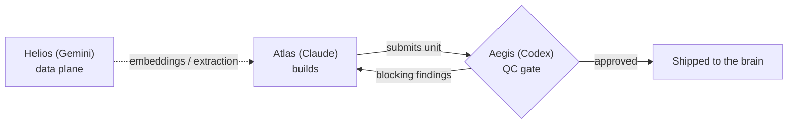
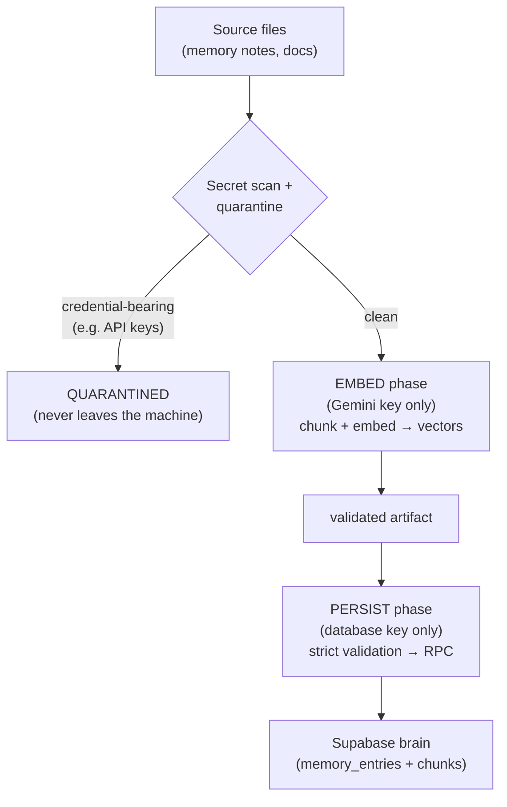
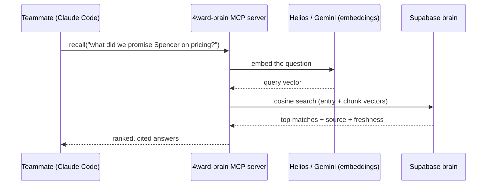

# Project 4ward — Team Overview & Architecture

*The shared "second brain" for 4ward Motion Solutions.* This doc is for the whole team — what we're
building, why, how it works, and where it's going. (Diagrams render on GitHub; ASCII versions included
so they read anywhere.)

---

## 1. Why this exists (the one-paragraph version)

Today, the company's institutional knowledge — what we're building, for whom, deal terms, credentials,
the *why* behind decisions — lives in one person's local files and head. **That's a single point of
failure:** if that person is unavailable, the team inherits a pile of repos with no map, and partners
can't connect because they don't have access. **Project 4ward moves that brain into a durable,
access-controlled, shared system** so the company survives the loss of any individual and every
teammate can recall and contribute on demand — a full-scale **development + sales + maintenance
factory**.

---

## 2. System architecture (the hero diagram)

```
                          ┌──────────────────────────────────────────────┐
                          │           SUPABASE  — the shared brain         │
                          │                                                │
                          │   Postgres + pgvector (semantic search)        │
                          │   Auth · Row-Level Security · Storage           │
                          │   Realtime · Edge Functions · audited vault     │
                          └──────────────────────────────────────────────┘
                              ▲                ▲                     ▲
              ┌───────────────┘                │                     └───────────────┐
              │                                │                                     │
   ┌────────────────────┐          ┌────────────────────────┐          ┌────────────────────────┐
   │  4ward-brain MCP    │          │   Web dashboard         │          │   Ingestion pipeline    │
   │  server             │          │   (browser, zero-install)│          │   (knowledge → brain)   │
   │  → each teammate's  │          │   → every teammate,      │          │   embed → persist       │
   │    Claude Code      │          │     incl. non-technical  │          │   (split credentials)   │
   └────────────────────┘          └────────────────────────┘          └────────────────────────┘
        "ask the brain"                  "see the brain"                     "feed the brain"
        recall / remember                projects, docs, deals,              memory files + contracts
        (CLI power users)                activity feed (everyone)            → embedded + searchable
```

**Two front doors, one source of truth.** Technical teammates use the **MCP server** from their AI tools;
everyone else (and eventually everyone) uses the **web dashboard** in a browser. Both read/write the same
Supabase brain. Knowledge gets *in* through the ingestion pipeline.

---

## 3. The three AI agents

Project 4ward is built and operated by a coordinated trio — each with a name and a lane:

| Agent | Identity | Role |
|---|---|---|
| **Atlas** | Claude (Claude Code) | Leads engineering & implementation — holds up the company's collective knowledge so it never rests on one person. |
| **Aegis** | Codex | Adversarial QA/QC — the shield. Reviews and *gates* every unit before it ships. |
| **Helios** | Gemini | The data plane — embeddings, document extraction, classification, high-volume processing. |

They coordinate **through the git repo** (commit = send, pull = receive): discussion lives in
`docs/threads/`, decisions get mirrored into the canonical docs. *(Target: this moves into the brain
itself — an `agent_messages` table you can watch live in the dashboard.)*



---

## 4. How knowledge gets *in* — the ingestion pipeline

Knowledge (memory notes, contracts, specs) is turned into searchable vectors in two **credential-split**
phases, so no single process holds both the AI key and the database key:



- **Secrets never reach the AI or the database** — a scan quarantines any credential-bearing file first.
- **Split credentials** — the embed step holds only the AI key; the persist step holds only the database
  key. Neither holds both.
- **Every write is validated twice** (once before the database, once inside the database) and recorded in
  an append-only audit log.

*Status: the first real corpus is **live** — ~100 memory entries, embedded and recallable; credential
files were quarantined out.*

---

## 5. How knowledge comes *out* — recall



Ask in plain language; get back the most relevant memories with **where they came from** and **how fresh
they are** — instead of hunting through files.

---

## 6. Access & security model

**Survivability first:** every active teammate can *see and use* everything — no one is ever locked out
of the company's knowledge. But high-blast-radius **integrity** actions are gated:

| Action | Who |
|---|---|
| Read knowledge / business docs / deals | **Everyone** (full access) |
| Write knowledge & docs | Everyone |
| **Change/remove team membership** | Admins only (+ a "can't delete the last admin" safety) |
| **Read a secret's value** | Only via an **audited** retrieval that logs every access |
| **Forge/edit the audit log** | No one (append-only) |
| **Write code** | Flagged developers (e.g., Dave Fagel, Bryan Hill) |

Secrets are never stored in plain text in general tables and never committed to any repo.

---

## 7. What's stored (data domains)

- **Memory** — the second-brain notes (semantically searchable).
- **Projects / Repos / Databases / Deployments** — the build registry.
- **Documents** — SOWs, MOUs, proposals, specs (text-extracted + searchable).
- **Clients / Contacts / Deals** — the sales factory.
- **Secrets vault** — credentials, access-logged.
- **Activity log** — who did what, when (powers a live "what's everyone working on" feed).

---

## 8. Roadmap

| Phase | What | Status |
|---|---|---|
| **0 — Provision** | Schema, security model, secrets vault | ✅ Complete |
| **1 — Continuity core** | Ingest the brain + recall (MCP server) | 🟢 Ingestion live; recall in QC |
| **2 — Team onboarding** | Accounts + the **web dashboard** (the team's front door) | ⏭️ Next |
| **3 — Sales factory** | Pipeline, proposals/MOUs, deal stages | Planned |
| **4 — Dev + Ops factory** | Live registry, deploy map, incidents | Planned |
| **5 — "4ward Router"** | A proprietary internal gateway to many AI models (route the right model per task to control cost & flexibility) + an installable desktop app | Roadmap |

---

## 9. How we keep it trustworthy

Every change runs an **adversarial QC gauntlet**: Atlas builds, Aegis tries to break it, nothing ships
until it passes. On the ingestion pipeline alone this caught — *before anything went live* — a path that
would have sent credentials to an outside AI service, a team-wipe permission hole, an audit-forgery hole,
and several data-integrity bugs. **Token efficiency is engineered in too:** load only what's relevant
per task (scoped context + on-demand retrieval + right-sized model), so cost scales gracefully as the
brain grows.

---

*Maintained by Atlas. Canonical detail lives in `docs/VISION.md`; agent coordination in `docs/threads/`.*
